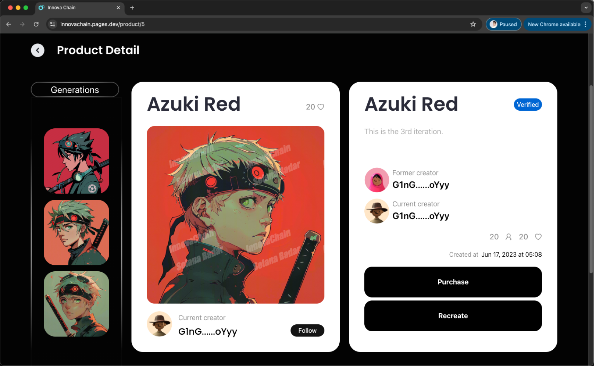
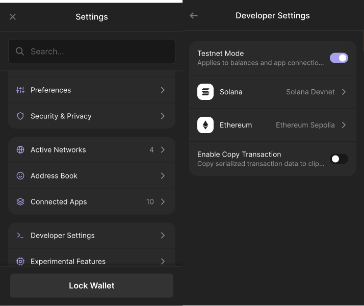
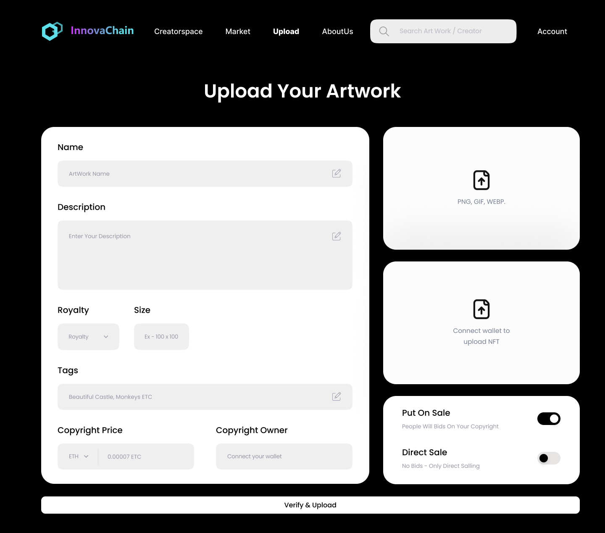
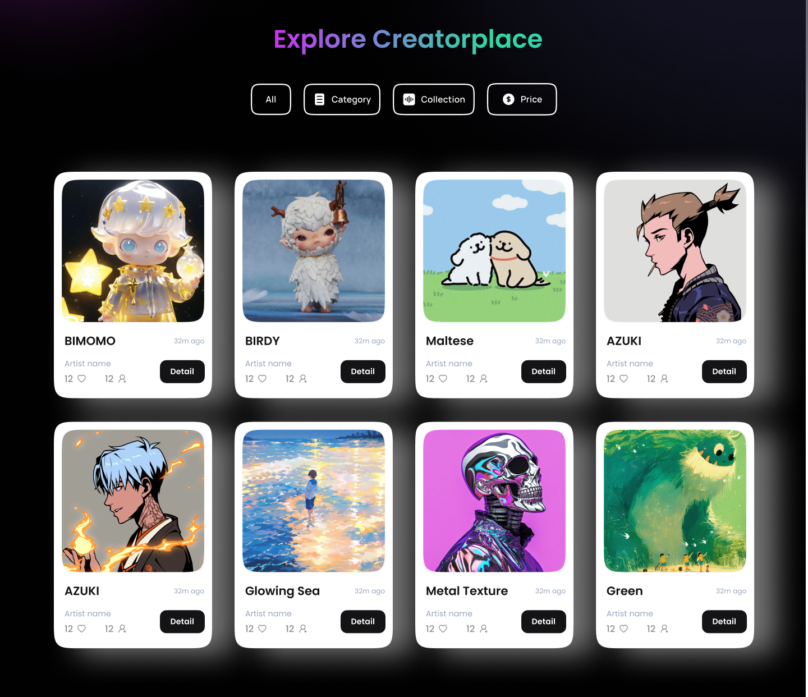
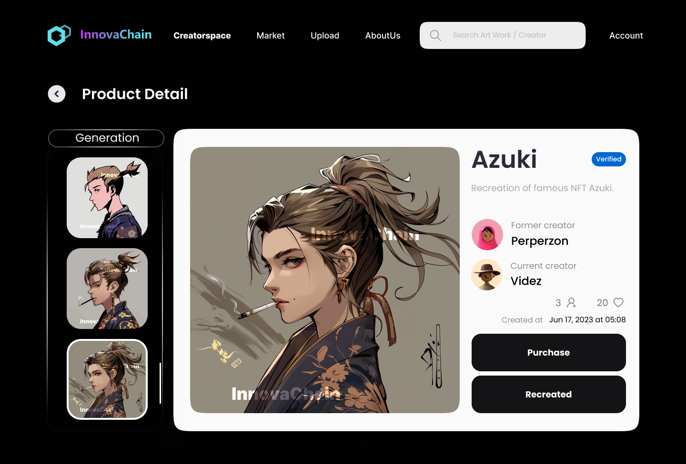
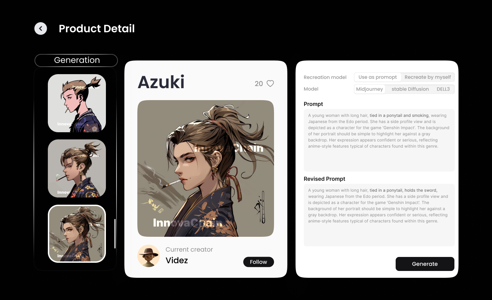
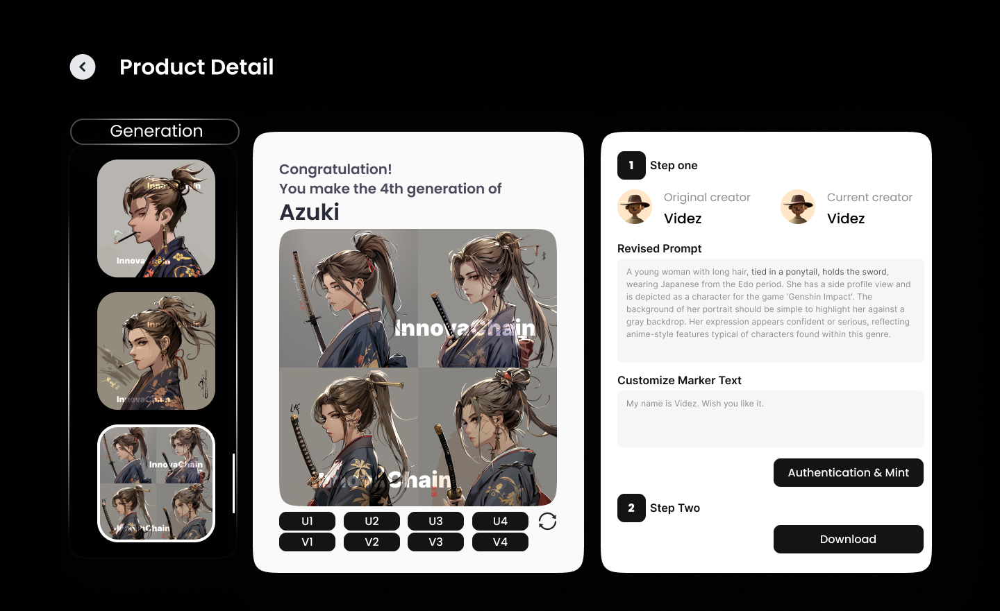
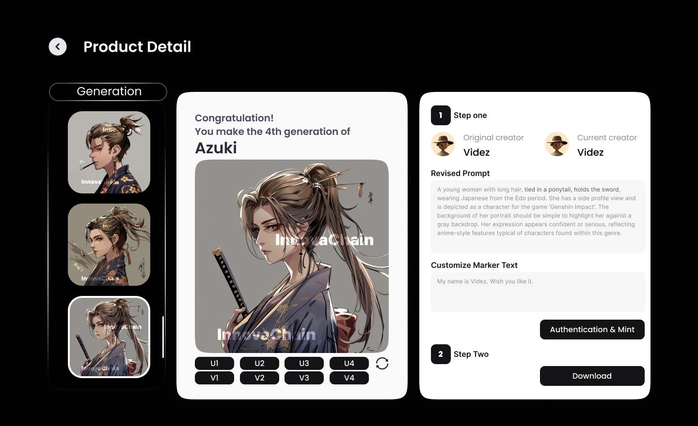

<!-- Improved compatibility of back to top link: See: https://github.com/othneildrew/Best-README-Template/pull/73 -->
<a id="readme-top"></a>
<!--
*** Thanks for checking out the Best-README-Template. If you have a suggestion
*** that would make this better, please fork the repo and create a pull request
*** or simply open an issue with the tag "enhancement".
*** Don't forget to give the project a star!
*** Thanks again! Now go create something AMAZING! :D
-->


<!-- PROJECT SHIELDS -->
<!--
*** I'm using markdown "reference style" links for readability.
*** Reference links are enclosed in brackets [ ] instead of parentheses ( ).
*** See the bottom of this document for the declaration of the reference variables
*** for contributors-url, forks-url, etc. This is an optional, concise syntax you may use.
*** https://www.markdownguide.org/basic-syntax/#reference-style-links
-->
<!--
[![Contributors][contributors-shield]][contributors-url]
[![Forks][forks-shield]][forks-url]
[![Stargazers][stars-shield]][stars-url]
[![Issues][issues-shield]][issues-url]
[![MIT License][license-shield]][license-url]
[![LinkedIn][linkedin-shield]][linkedin-url]
-->


<!-- PROJECT LOGO -->
<br />
<div align="center">
  <a href="https://github.com/github_username/repo_name">
    
  </a>
<h3 align="center">InnovaChain</h3>

  <p align="center">
    project_description
    <br />
    <a href="https://github.com/InnovaChain/InnovaChain_total"><strong>Explore the docs »</strong></a>
    <br />
    <br />
    <a href="https://innovachain.pages.dev/">View Demo</a>
    ·
    <a href="https://github.com/InnovaChain/InnovaChain_total/issues/new?labels=bug&template=bug-report---.md">Report Bug</a>
    ·
    <a href="https://github.com/InnovaChain/InnovaChain_total/issues/new?labels=bug&template=bug-report---.md/issues/new?labels=enhancement&template=feature-request---.md">Request Feature</a>
  </p>

</div>


<!-- TABLE OF CONTENTS -->

<details>
  <summary>Table of Contents</summary>
    <ol>
        <li>
            <a href="#1-about-the-project">About The Project</a>
            <ul>
                <li><a href="#11-built-with">Built With</a></li>
            </ul>
        </li>
        <li>
            <a href="#2-getting-started">Getting Started</a>
            <ul>
                <li><a href="#21-local-setup">Local Setup</a>
                    <ul>
                        <li><a href="#211-back-end-setup">Back-end Setup</a>
                            <ul>
                                <li><a href="#2111-prerequisites">Prerequisites</a></li>
                                <li><a href="#2112-installation">Installation</a></li>
                                <li><a href="#2113-database-initialization">Database Initialization</a></li>
                                <li><a href="#2114-running-the-application">Running the Application</a></li>
                            </ul>
                        </li>
                        <li><a href="#212-front-end-setup">Front-end Setup</a>
                            <ul>
                                <li><a href="#2121-prerequisites">Prerequisites</a></li>
                                <li><a href="#2122-installation">Installation</a></li>
                                <li><a href="#2123-development">Development</a></li>
                                <li><a href="#2124-building-for-production">Building for Production</a></li>
                            </ul>
                        </li>
                    </ul>
                </li>
                <li><a href="#22-online-demo">Online Demo</a></li>
            </ul>
        </li>
        <li><a href="#3-usage">Usage</a></li>
        <li><a href="#4-roadmap">Roadmap</a></li>
        <li><a href="#5-contributing">Contributing</a></li>
        <li><a href="#6-license">License</a></li>
        <li><a href="#7-contact">Contact</a></li>
        <li><a href="#8-acknowledgments">Acknowledgments</a></li>
    </ol>
</details>


<!-- ABOUT THE PROJECT -->

# 1. About The Project
Our platform helps creators protect their intellectual property in the world of AI-generated content. With the rise of AI image generation tools, it’s become very easy for anyone to replicate others art without permission, leading to issues of copyright infringement. Innovachain transforming AI-Generated content into secure, traceable, collaborative creations, which create a new generation of creator ecosystem.




<p align="right">(<a href="#readme-top">back to top</a>)</p>


### 1.1. Built With

* Front-end
  * React 18
  * Vite
  * TypeScript
  * React Router
  * React Query
  * Tailwind CSS
* Back-end
  * Anchor CLI
  * Database
    * SQLAlchemy
    * Alembic 
* Text-to-Image
  * Midjourney
  * Bun
  * Hono
* Solana
  * Solana Web3.js
  * Solana CLI
* Invisible Watermark
  * OpenCV
  * Tensorflow
* Docker

<p align="right">(<a href="#readme-top">back to top</a>)</p>


<!-- GETTING STARTED -->

# 2. Getting Started

## 2.1. Local Setup

These instructions will get you a copy of the project up and running on your local machine for development and testing purposes.

### 2.1.1. Back-end Setup

#### 2.1.1.1. Prerequisites

Before you begin, make sure you have the following installed:

- Python 3.7+
- Solana CLI
- Anchor CLI

#### 2.1.1.2. Installation

Ensure that your system has Python 3.7+ installed. Follow these steps to set up the development environment:

1. **Create a Virtual Environment**:

   ```
   python -m venv .venv
   ```

2. **Activate the Virtual Environment**:

   - Windows:

     ```
     .venv\Scripts\activate
     ```

   - macOS/Linux:

     ```
     source .venv/bin/activate
     ```

3. **Install Dependencies**:

   ```
   pip install -r requirements.txt
   ```

#### 2.1.1.3. Database Initialization

Innovachain uses SQLAlchemy as the ORM and Alembic for database migration management. Follow these steps to initialize the database:

1. **Initialize Alembic**:

   ```
   alembic init alembic
   ```

2. **Configure Database Connection**: Edit the `sqlalchemy.url` in the `alembic.ini` file to:

   ```
   sqlalchemy.url = sqlite:///data/innovachain.db
   ```

3. **Generate Initial Migration Script**:

   ```
   alembic revision --autogenerate -m "Initial migration"
   ```

4. **Apply Migrations**:

   ```
   alembic upgrade head
   ```

#### 2.1.1.4. Running the Application

After completing the above steps, you can start the Innovachain application using the following command:

```
uvicorn main:app --reload
```

This will start a development server locally, defaulting to port 8000. You can access the application by visiting `http://127.0.0.1:8000/`

### 2.1.2. Front-end Setup
#### 2.1.2.1. Prerequisites

Before you begin, make sure you have the following installed:

- Node.js (v18 or later)
- pnpm


#### 2.1.2.2. Installation

Ensure that your system has Node.js installed. Follow these steps to set up the development environment:

1. Make sure you are in the frontend directory:

   ```
   cd Innovachain_frontend
   ```

2. **Install dependencies**:

   ```
   pnpm install
   ```

3. **Add environment variables**:

    Create a `.env` file in the frontend directory and add the following environment variables:
  
    ```
    VITE_INNOVA_CHAIN_ENV=devnet
    VITE_DISABLED_POLYFILLS=false
    VITE_API_URL=***
    VITE_MIDJOURNEY_API_URL=***
    ```

    Note that the `VITE_API_URL` and `VITE_MIDJOURNEY_API_URL` should point to the backend and Midjourney API URLs respectively. We redacted the actual URLs for security and rate limiting reasons. We encourage you to set up your own backend and Midjourney API services with docker.

#### 2.1.2.3. Development

To run the development server:

```
pnpm dev
```

The application will be available at the default vite local server or `http://localhost:5173`.


### 2.1.3 Text-to-Image Setup

#### 2.1.3.1. Prerequisites

Before you begin, make sure you have the following installed:

- Bun (v1.1.29 or later)

#### 2.1.3.2 Installation

Ensure that your system has Bun installed. Follow these steps to set up the development environment:

1. Make sure you are in the mijourney directory:

   ```
   cd midjourney-api
   ```

2. **Install dependencies**:

   ```
   bun install
   ```

3. **Add environment variables**:

    Create a `.env` file in the frontend directory and add the following environment variables:
  
    ```
    SERVER_ID=***
    CHANNEL_ID=***
    SALAI_TOKEN=***
    BACKEND_API_URL=***
    ```

    All the environment variables are redacted for security reasons. We encourage you to set up your own midjourney token on Discord. `BACKEND_API_URL` should point to the backend API URL.

#### 2.1.3.3. Development

To run the development server:

```
bun dev
```

The application will be available at `http://localhost:8080`.


## 2.2. Online Demo

There is an online demo available on https://innovachain.pages.dev/, directly try it here!

<p align="right">(<a href="#readme-top">back to top</a>)</p>


<!-- USAGE EXAMPLES -->

## 3. Usage

Use this space to show useful examples of how a project can be used. 

### 3.1. Wallet Setting
First, you need to link to Solana's wallet. During the testing phase, it is recommended to use the Phantom Wallet, switch to developer mode, and choose Devnet for the network



### 3.1. Upload
Then you can click upload in the navigation bar, select an image or NFT (in the demo, only upload images function are available), and fill in some basic information. Click the button and waitting for some seconds to waitting for the wallet to signature.



### 3.2. Homepage Creatorspace
Then, you'll go to the homepage called creatorspace, where you can see many of the works that have been uploaded by original creators or that have been recreated by others. In the bottom of this page, you can find the work upload just now. Choose one that you like.



### 3.3. Work Detail
In the details page, you can see the work clearly, as well as the previous generations of the work. And information about the previous and current author of the current work. Click the create button to go to re-create with this work.



### 3.4. Revise Prompt
On this page, you can select the AI model you want to use and modify the current promot. Here I change from smoking to holding the sword. Next, click generate button. This process will take some time.



### 3.5. Generate Image & Choose Version
Now you have four generated images, select different V buttons to generate different variation images corresponding to the number, select U button to generate the corresponding final result. For example, I choose U2, which means that the second image is generated into the final version.



### 3.6. Add Customize Maker Text & Authenticate to get digital watermark & Mint it on Chain
You can write some introduction to your work, or some personalized content. Then you can click Authenticate & Mint. In this process, we will add a hidden digital watermark to your work, wait a few seconds to complete the signature in the wallet, at which point you have finished uploading the information to Solana. You can find the corresponding information in Solscan. When someone steals your work, you can use it as proof.



### 3.7. Find your work and reward in  your account
You can find your works in your account, as well as the income generated by others after their secondary creation or use.


<p align="right">(<a href="#readme-top">back to top</a>)</p>


<!-- ROADMAP -->

## 4. Roadmap

- [x] Back-end Development
- [x] Front-end Development
- [x] Watermark Development
- [x] Solana Contract Development & Deployment
- [x] Project Local Test
- [x] Project Online Test
- [x] User Test
- [ ] More Specific Features Regarding User Needs
- [ ] Large-scale application

See the [open issues](https://github.com/InnovaChain/InnovaChain_total/issues) for a full list of proposed features (and known issues).

<p align="right">(<a href="#readme-top">back to top</a>)</p>


<!-- CONTRIBUTING -->
## 5. Contributing

Contributions are what make the open source community such an amazing place to learn, inspire, and create. Any contributions you make are **greatly appreciated**.

If you have a suggestion that would make this better, please fork the repo and create a pull request. You can also simply open an issue with the tag "enhancement".
Don't forget to give the project a star! Thanks again!

1. Fork the Project
2. Create your Feature Branch (`git checkout -b feature/AmazingFeature`)
3. Commit your Changes (`git commit -m 'Add some AmazingFeature'`)
4. Push to the Branch (`git push origin feature/AmazingFeature`)
5. Open a Pull Request

<p align="right">(<a href="#readme-top">back to top</a>)</p>

### 6. Top contributors:


- [Alex](https://github.com/AWI-20) - Technical framework and digital watermark
- [Tron](https://github.com/chuanglyu0402) - Product management and uiux design
- [9te](https://github.com/9teMare) - frontend
- [yyy](https://github.com/0xy0ung) - backend and smart contract


<!-- LICENSE -->

## 7. License

Distributed under the MIT License. See `LICENSE.txt` for more information.

<p align="right">(<a href="#readme-top">back to top</a>)</p>


<!-- CONTACT -->

## 8. Contact

Tron - [@chuanglyu0402](https://x.com/Eureka_Lyu_eth) - chuanglyu010402@gmail.com


Project Link: [https://github.com/InnovaChain/InnovaChain_total](https://github.com/InnovaChain/InnovaChain_total)

<p align="right">(<a href="#readme-top">back to top</a>)</p>


<!-- ACKNOWLEDGMENTS -->
## 9. Acknowledgments

We would like to extend our heartfelt thanks to the following organizations and teams for their invaluable support throughout the development of this project:

* **Solana Foundation** - For providing technical guidance and resources that greatly contributed to the success of our blockchain implementation.
* **Franklin Team** - For their strategic insights and continuous encouragement, helping us refine and strengthen our vision.
* **HackerQuest** - For creating an inspiring and collaborative environment that pushed us to innovate and achieve new heights.

Your contributions have been instrumental in bringing this project to life, and we are deeply grateful for your support.


<p align="right">(<a href="#readme-top">back to top</a>)</p>


<!-- MARKDOWN LINKS & IMAGES -->
<!-- https://www.markdownguide.org/basic-syntax/#reference-style-links -->

[contributors-shield]: https://img.shields.io/github/contributors/InnovaChain/InnovaChain_total.svg?style=for-the-badge
[contributors-url]: https://github.com/InnovaChain/InnovaChain_total/graphs/contributors
[forks-shield]: https://img.shields.io/github/forks/InnovaChain/InnovaChain_total.svg?style=for-the-badge
[forks-url]: https://github.com/InnovaChain/InnovaChain_total/network/members
[stars-shield]: https://img.shields.io/github/stars/InnovaChain/InnovaChain_total.svg?style=for-the-badge
[stars-url]: https://github.com/InnovaChain/InnovaChain_total/stargazers
[issues-shield]: https://img.shields.io/github/issues/InnovaChain/InnovaChain_total.svg?style=for-the-badge
[issues-url]: https://github.com/InnovaChain/InnovaChain_total/issues
[license-shield]: https://img.shields.io/github/license/InnovaChain/InnovaChain_total.svg?style=for-the-badge
[license-url]: https://github.com/InnovaChain/InnovaChain_total/blob/master/LICENSE.txt
[linkedin-shield]: https://img.shields.io/badge/-LinkedIn-black.svg?style=for-the-badge&logo=linkedin&colorB=555
[linkedin-url]: https://linkedin.com/in/linkedin_username
[product-screenshot]: images/screenshot.png
[Next.js]: https://img.shields.io/badge/next.js-000000?style=for-the-badge&logo=nextdotjs&logoColor=white
[Next-url]: https://nextjs.org/
[React.js]: https://img.shields.io/badge/React-20232A?style=for-the-badge&logo=react&logoColor=61DAFB
[React-url]: https://reactjs.org/
[Vue.js]: https://img.shields.io/badge/Vue.js-35495E?style=for-the-badge&logo=vuedotjs&logoColor=4FC08D
[Vue-url]: https://vuejs.org/
[Angular.io]: https://img.shields.io/badge/Angular-DD0031?style=for-the-badge&logo=angular&logoColor=white
[Angular-url]: https://angular.io/
[Svelte.dev]: https://img.shields.io/badge/Svelte-4A4A55?style=for-the-badge&logo=svelte&logoColor=FF3E00
[Svelte-url]: https://svelte.dev/
[Laravel.com]: https://img.shields.io/badge/Laravel-FF2D20?style=for-the-badge&logo=laravel&logoColor=white
[Laravel-url]: https://laravel.com
[Bootstrap.com]: https://img.shields.io/badge/Bootstrap-563D7C?style=for-the-badge&logo=bootstrap&logoColor=white
[Bootstrap-url]: https://getbootstrap.com
[JQuery.com]: https://img.shields.io/badge/jQuery-0769AD?style=for-the-badge&logo=jquery&logoColor=white
[JQuery-url]: https://jquery.com
